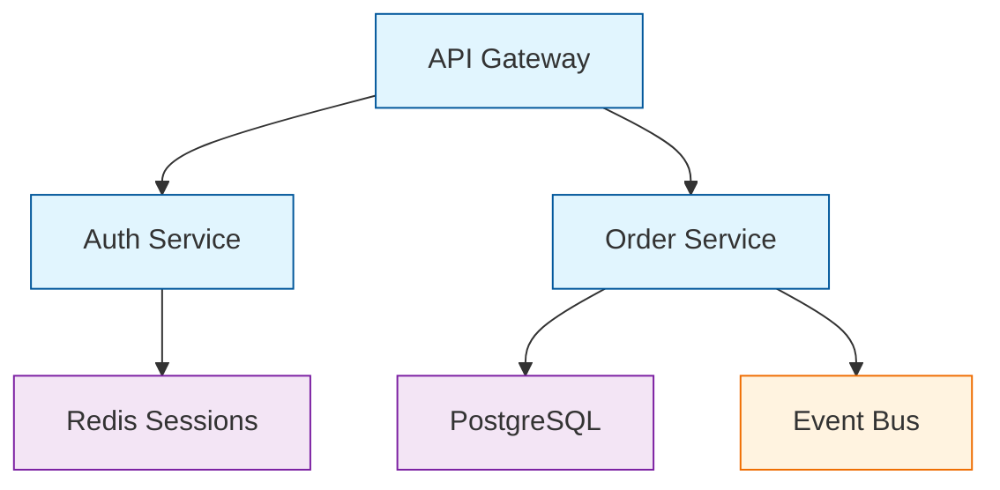
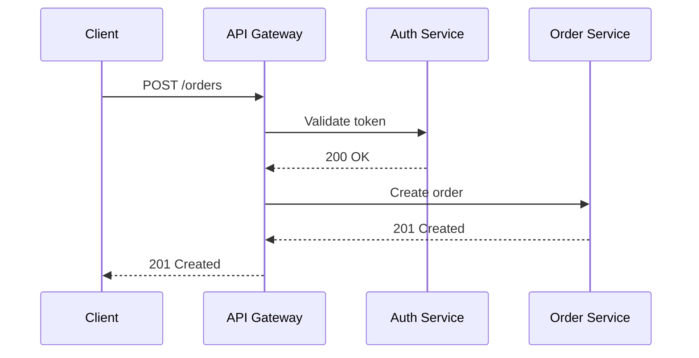
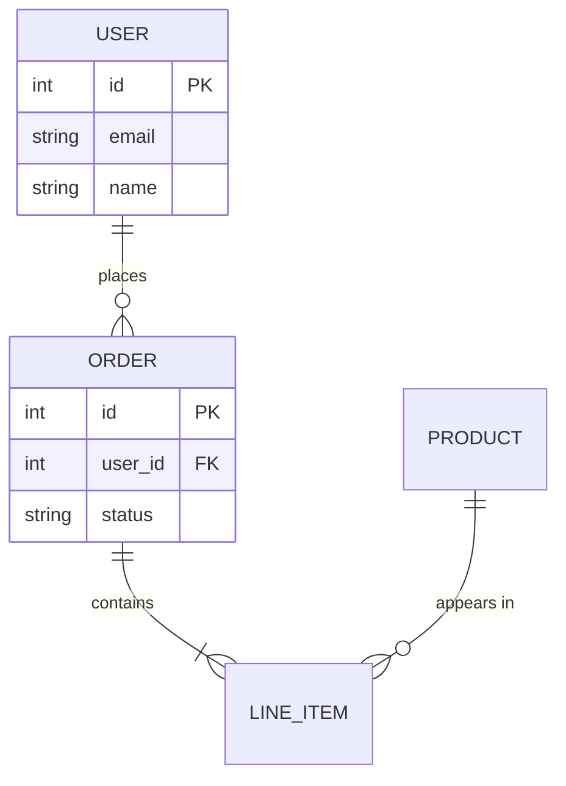
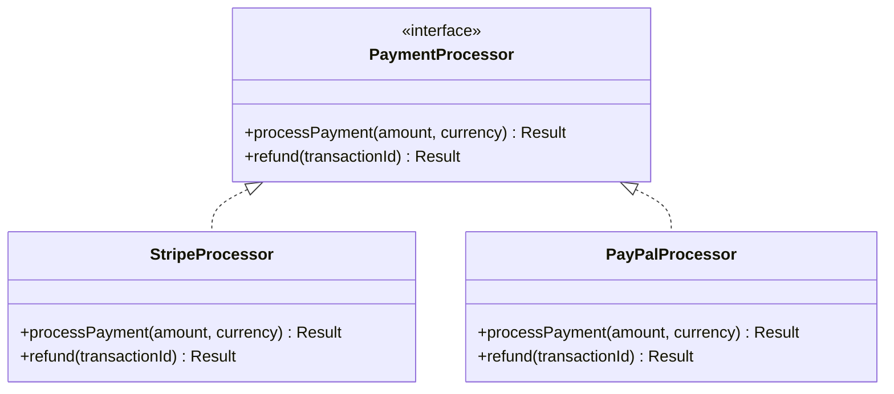
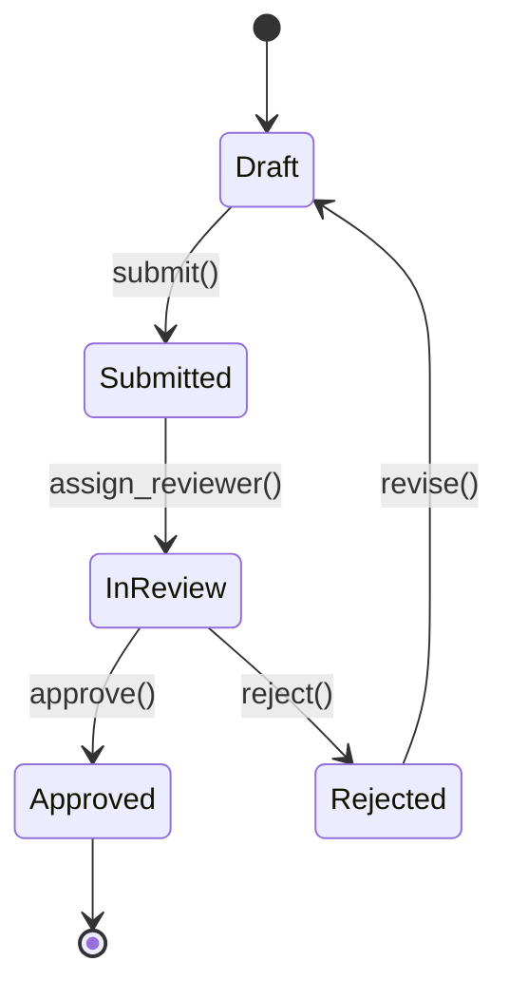

# Illustrate Complexity with Mermaid Diagrams

**Use a Mermaid diagram whenever it communicates structure, flow, or relationships more clearly than prose.** The test: if the structure takes more than a paragraph to explain, and you keep wanting to say "and then" or "which connects to" or "if ...", it should be a diagram. Don't diagram for the sake of diagramming - use diagrams when they earn their keep.

This applies wherever you are explaining something, not only when you are planning.

## When to Diagram

- **Architecture & component relationships** - what depends on what, how things connect
- **Sequences of interactions** - API calls, user flows, event chains, multi-step processes
- **Data models & entity relationships** - schemas, table relationships, domain models
- **State machines & decision logic** - status transitions, branching workflows
- **Class/module structure** - inheritance hierarchies, interface contracts, module boundaries

## Choosing the Right Diagram Type

Pick the diagram type that matches what you're communicating:

| What you're showing | Diagram type | Mermaid syntax |
|---|---|---|
| Component dependencies, system topology, task breakdowns | **Flowchart** | `graph TD` or `graph LR` |
| Request/response flows, API call sequences, multi-actor interactions | **Sequence diagram** | `sequenceDiagram` |
| Database schemas, domain models, data relationships | **ER diagram** | `erDiagram` |
| Inheritance, interfaces, module contracts | **Class diagram** | `classDiagram` |
| Status lifecycles, workflow states | **State diagram** | `stateDiagram-v2` |

Use `TD` (top-down) for hierarchies and dependencies. Use `LR` (left-right) for sequential flows.

These five cover most cases. If what you need to show is none of them, Mermaid also draws timelines, Gantt charts, mindmaps, C4 models, and more - see the [diagram syntax reference](https://mermaid.js.org/intro/syntax-reference.html).

## Visual Elements for Rapid Scanning

Use these visual elements sparingly to draw attention to critical areas of a diagram:

```
🎯 Main goals and objectives
✅ Completed components  
🔧 Technical implementation details
🎨 User-facing features and interfaces
⚠️ Risk areas, blockers, or dependencies
🔄 Iterative or recurring processes
📊 Data flow or state management
🌐 External integrations or APIs
```

## Syntax Rules

These prevent rendering failures:

1. **Always quote node labels** with double quotes: `A["Node Label"]`
2. **Escape special characters** - use `#quot;` for quotes inside labels, `#amp;` for ampersands. The `#` instead of `&` on-purpose and important: because Mermaid often renders within HTML documents, it uses its own entity format to ensure that the HTML renderer does NOT process it - only the Mermaid renderer.
3. **Use `subgraph` blocks** to group related nodes - label them clearly
4. **Use `classDef` + `:::className`** for styling - never inline `style` statements
5. **Keep diagrams focused.** If a single diagram exceeds ~15-20 nodes, consider if it should be split into multiple diagrams with clear titles explaining what each one covers. Do not split when this reduces clarity - sometimes you really do need a big diagram.

## Flowcharts

Best for: architecture overviews, dependency graphs, decision trees, task breakdowns.



## Sequence Diagrams

Best for: API flows, user interactions, multi-service choreography, anything where **order matters**.



## ER Diagrams

Best for: database design, domain modeling, data relationships.



## Class Diagrams

Best for: OOP design, interface contracts, module boundaries.



## State Diagrams

Best for: lifecycle management, status workflows, FSMs.



## Where the Diagram Will Be Read

Pick the type from the table above. Then size the diagram for the place a reader will meet it.

**Documentation and READMEs.** A large diagram is fine here, and usually better than a trimmed one. Rendered on the web, the reader can expand it and pan around, so completeness beats brevity.

**Plans and design notes.** The diagram is the artifact's backbone, not decoration. High detail and completeness are paramount. Refer to it from the prose that follows, so the reader knows it carries weight.

**Answers in chat.** Keep it small. Most chat interfaces render Mermaid poorly or not at all, and a wide diagram is unreadable in a narrow column. Split a large one, or diagram only the part that carries the confusion and write the rest as prose.

