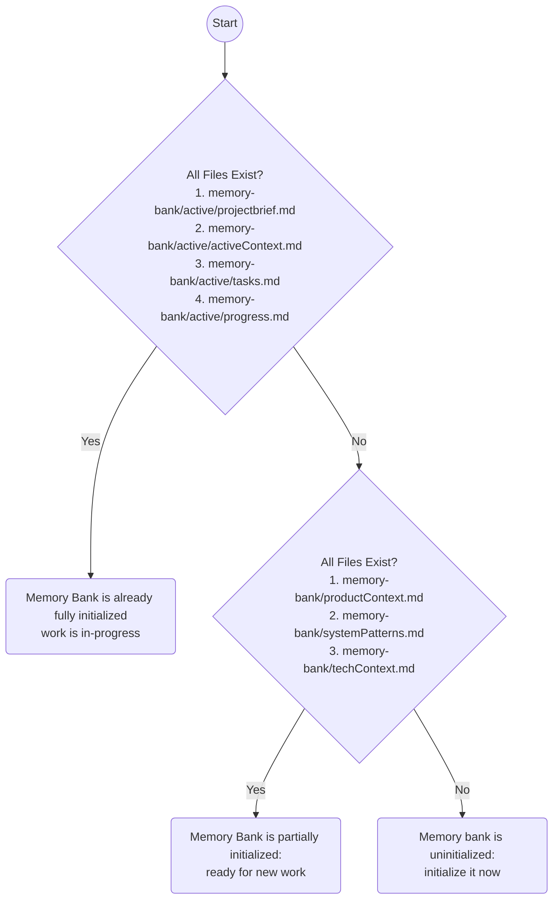

# Memory Bank Initialization & Verification



## Uninitialized

If the memory bank is completely uninitialized, the following persistent files must be created:

1. `memory-bank/productContext.md`
    * The "Product Context File" is the business context of this collection of files: target users, use cases, success criteria, constraints. If this information is not obvious from traditional documentation sources, prompt the user for more information.
    * Load: `.cursor/rules/shared/niko/memory-bank/productContext.mdc` and create the file by following the instructions in the rule.
2. `memory-bank/systemPatterns.md`
    * The "System Patterns File" is the architectural patterns of this collection of files: code organization, naming conventions, design patterns in use. Scan the codebase for significant patterns (nonstandard or high-criticality) and document them.
    * Load: `.cursor/rules/shared/niko/memory-bank/systemPatterns.mdc` and create the file by following the instructions in the rule.
3. `memory-bank/techContext.md`
    * The "Tech Context File" summarizes how to work with the technology stack(s) in use in the project. Identify the tools, commands, frameworks, and design system references that should be top-of-mind while working on the project. Do NOT include session-specific info (current branch, current task, local environment, etc).
    * Load: `.cursor/rules/shared/niko/memory-bank/techContext.mdc` and create the file by following the instructions in the rule.

**🚨 CRITICAL:** If initializing the memory bank in preparation for a user-initiated task, do *not* take the user's task into account when creating the persistent files. The persistent files should be able to stand on their own, in a vacuum, regardless of the user's task. Including knowledge of the user's task in the persistent files will pollute them with stale, temporary information!

**🚨 CRITICAL:** Before writing persistent files, scan for existing AI-facing documentation (`.cursor/rules/`, `.claude/`, `AGENTS.md`, `CLAUDE.md`, or equivalent). Persistent files must not duplicate information already present in these files - they serve different purposes. Persistent files capture *project knowledge* (business context, non-obvious architecture, tech stack orientation). Rule files capture *working instructions* (how to test, how to format output, coding conventions). If a fact is already in a rule file, omit it from the persistent file or reference the rule file instead.

### Root bootstrap files

After the persistent files exist, install a thin root bootstrap pair **only when both** repo-root `AGENTS.md` and `CLAUDE.md` are absent. Presence means the path exists at the repo root (regular file or symlink). Do not follow symlinks to edit through them.

| Root `AGENTS.md` | Root `CLAUDE.md` | Action |
| --- | --- | --- |
| absent | absent | Create both from the templates below |
| absent | present | Create neither |
| present | absent | Create neither |
| present | present | Create neither |

When either file is already present: create neither bootstrap file; do not append to, rewrite, or symlink-replace the existing one(s); print a brief advisory that existing bootstrap file(s) were found and left alone, that `memory-bank/` is the preferred GlobalPrompt, and that cleaning house is the operator's choice — do not invoke a migration skill.

Do not create one file when the other already exists. Do not inline or `@`-import persistent file bodies into the bootstrap files. Keep the templates generic (roles and backtick paths only) so they survive rare layout changes.

#### `AGENTS.md` template

Write exactly:

~~~markdown
# Agent context

Tracked agent-facing project knowledge lives under `memory-bank/`. Prefer those files over inventing project facts.

## Persistent files

- `memory-bank/productContext.md` — business context: users, use cases, success criteria, constraints
- `memory-bank/systemPatterns.md` — architecture and naming patterns in use
- `memory-bank/techContext.md` — stack, tools, and how to work in this repo

## Archives

Completed work is summarized under `memory-bank/archive/<kind>/YYYYMMDD-<task-id>.md`.

## Active work

`memory-bank/active/` holds the current-task execution trace. If those files exist, an in-flight task may be underway — consult them before starting work that could collide.

## When to load

When the task needs project, architecture, or stack context, read the relevant persistent file(s). Do not load every memory-bank file on every chat.
~~~

#### `CLAUDE.md` template

Write exactly:

~~~markdown
@AGENTS.md
~~~

Once the persistent files (and, when applicable, the root bootstrap pair) have been created, the memory bank is partially initialized, and ready for new work.

### Output to User:

```markdown
✅ **Memory Bank Initialized** - Ready for new work.
```

## Partially Initialized - Ready for New Work

Once the memory bank has been partially initialized with the persistent files and is ready for new work, the following ephemeral files must be created or updated for that work. These files will normally be created during complexity analysis and/or planning phases. In case you need to create or update one these files out-of-band, here's how:

1. `memory-bank/active/projectbrief.md`
    * The "Project Brief File" is the current session deliverable: user story & requirements.
    * Load: `.cursor/rules/shared/niko/memory-bank/active/projectbrief.mdc` and create the file by following the instructions in the rule.
2. `memory-bank/active/activeContext.md`
    * The "Active Context File" is the current session focus: what's being worked on now, recent decisions, immediate next steps.
    * Load: `.cursor/rules/shared/niko/memory-bank/active/activeContext.mdc` and create the file by following the instructions in the rule.
3. `memory-bank/active/tasks.md`
    * The "Tasks File" is the active task tracking: current task details, checklists, component lists.
    * Load: `.cursor/rules/shared/niko/memory-bank/active/tasks.mdc` and create the file by following the instructions in the rule.
4. `memory-bank/active/progress.md`
    * The "Progress File" is the implementation progress: history of completed work and phase transitions.
    * Load: `.cursor/rules/shared/niko/memory-bank/active/progress.mdc` and create the file by following the instructions in the rule.

**Note:** The ephemeral files will always contain information about a user-provided task. This is normal and expected; it is their purpose!