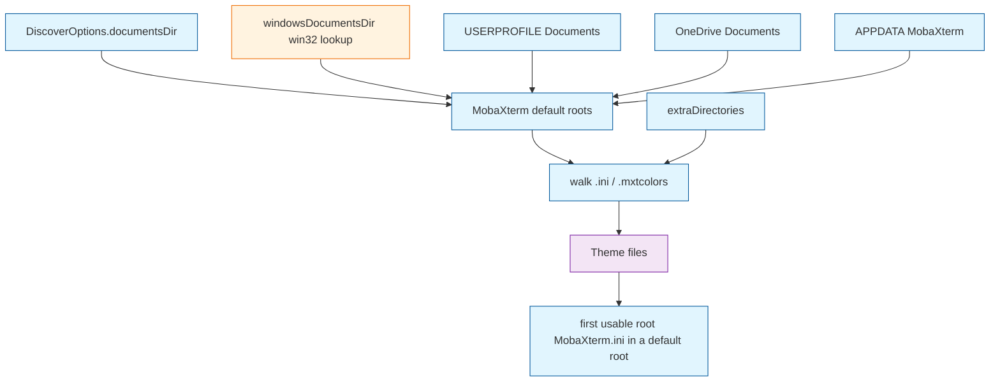

# Architecture Decision: MobaXterm Active Root

## Requirements & Constraints

**Functional:** When MobaXterm Installer Edition's applied `MobaXterm.ini` is on disk, `discoverThemes` lists it and marks that file `active`, even when Windows Documents is not `%USERPROFILE%\Documents` and not under `C:\Users`. Mirror can then include it among candidates.

**Quality attributes (ranked):**
1. **Fitness** — the applied INI is found and marked active on a generic Windows profile (any drive, Known Folder Move, split homedir).
2. **Simplicity** — no native addons; keep the existing first-default-root-wins + root-basename active rule.
3. **Maintainability** — vscode-free discovery; tests inject paths and do not spawn Windows helpers.
4. **Performance** — Documents lookup runs at most once per scan; activation-time cache (separate question) hides spawn cost.
5. **Risk** — extra-directory theme packs and nested backup INIs stay inactive.

**Technical constraints:** Node `fs` / `os` / `path` / `child_process` only in the core; `extensionKind` `["ui"]` so the scan runs on the Windows host; no new runtime dependencies.

**In scope:** default-root construction and active marking for MobaXterm.

**Out of scope:** portable INI beside the exe; `MobaXterm.exe -i`; `.mxtsessions`; dropdown indexes; scan cache (next open question).

## Components

`discoverMobaXterm` still owns roots, walk, and the active heuristic. The new piece is *how* the Documents root is obtained: injected in tests, Known Folder lookup on win32, then the existing USERPROFILE / OneDrive / AppData fallbacks. Extra directories remain a separate inactive walk.

## Options Evaluated

- **A — Known Folder Documents as a default root:** Resolve My Documents via the Known Folder API (`Environment.GetFolderPath('MyDocuments')` / `SHGetKnownFolderPath(FOLDERID_Documents)`), add `join(that, 'MobaXterm')` to default roots, keep USERPROFILE / OneDrive / AppData. Matches [MobaXterm's installer location](https://blog.mobatek.net/post/mobaxterm-configuration-settings/) (`%MyDocuments%\MobaXterm`). Aligns with best-effort discovery; extraDirs stay inactive.
- **B — `LastIniPath` registry as the active file:** Read `HKCU\Software\Mobatek\MobaXterm\LastIniPath` and treat that file (or its parent) as the applied config. Covers custom `-i` locations. Conflicts with the documented gap that `-i` / portable stay extraDirectories-only. The value is undocumented in vendor docs and can be an 8.3 short path.
- **C — Mark extraDirectory `MobaXterm.ini` as active:** Would light up a folder the user already added. Conflicts with PR #47: extra dirs are theme packs; nested/extra INIs must not become active.
- **D — Hardcode `C:\Users\...` or assume Documents lives under USERPROFILE:** Fails whenever the profile is split across volumes. Eliminated by the requirement that someone else's machine (and this class of machine) must work without a `C:\Users` layout.

## Analysis

| Criterion | A Known Folder | B LastIniPath | C extraDirs active |
|-----------|----------------|---------------|--------------------|
| Fitness | Installer edition wherever Documents actually is | Applied file even for `-i` | Only if the user configured extraDirectories |
| Simplicity | One extra root + lookup helper | Registry parse + short-path canonicalization | Small heuristic change, wrong layer |
| Maintainability | Injection for tests; vendor-documented location | Undocumented key; 8.3 paths | Reverses a reviewed invariant |
| Risk | Misses portable/`-i` (already a stated gap) | Could mark a stale or unexpected INI active; expands `-i` scope | Theme packs become "in use" |

Key insights:
- `%USERPROFILE%\Documents` is not My Documents. [SHGetKnownFolderPath](https://learn.microsoft.com/windows/win32/api/shlobj_core/nf-shlobj_core-shgetknownfolderpath) is the API; [do not treat Shell Folders as the API](https://devblogs.microsoft.com/oldnewthing/20110322-00/?p=11163).
- Vendor docs name `%MyDocuments%\MobaXterm` for the installer edition, which is option A.
- `LastIniPath` was observed to exist and to work, but it is not the generic contract we want to hang installer-edition support on, and using it as the primary active pointer would quietly close the `-i` gap.
- Option C is the workaround the last archive offered; it is not detection.

## Decision

### Choice Pre-Mortem

- **Installer INI is not under My Documents (user relocated it in MobaXterm settings or `-i`):** checked — that remains extraDirectories-only, same as today's documented gap.
- **PowerShell / Known Folder lookup fails in the ui-kind host:** checked — fallbacks below; tests inject `documentsDir` so CI does not depend on spawn.
- **Lookup that reads `User Shell Folders` drifts from `SHGetKnownFolderPath`:** checked — prefer GetFolderPath; registry Personal is fallback only, not the primary API.

**Selected**: Option A — Known Folder Documents as a MobaXterm default root.

**Rationale**: Fitness for installer edition on any Documents location without native code or drive-letter assumptions; simplicity of keeping the existing active rule; maintainability via injected `documentsDir` in tests.

**Tradeoff**: Portable / `-i` still require `extraDirectories`. `LastIniPath` is not the primary mechanism.

## Implementation Notes

- Add optional `documentsDir?: string` on `DiscoverOptions`. When set, use it and skip win32 lookup (tests).
- On `win32`, `windowsDocumentsDir()`:
  1. `powershell -NoProfile -NonInteractive -Command "[Environment]::GetFolderPath('MyDocuments')"` (wraps the Known Folder API).
  2. If that fails, `reg query HKCU\...\User Shell Folders /v Personal` and expand `REG_EXPAND_SZ`.
  3. If that fails, `undefined` (existing `USERPROFILE\Documents` root still runs).
- Deduplicate default roots with `path.resolve` so Known Folder and `USERPROFILE\Documents` are walked once when they coincide.
- Active rule unchanged: first usable `MobaXterm.ini` whose parent is a default root directory (not extraDirs, not nested).
- Export small stdout parsers if that keeps spawn untested and the lookup testable.
- Do not import `vscode`. Do not add ffi/native modules.
