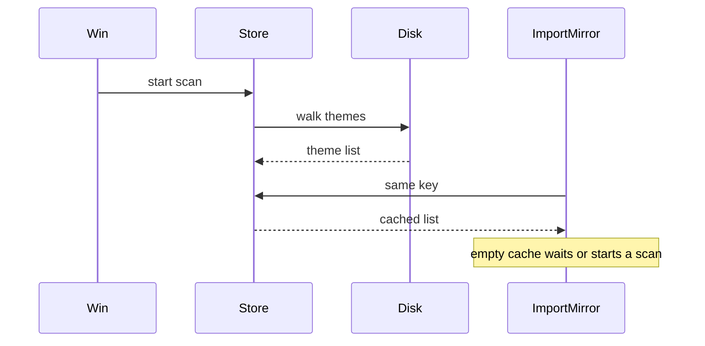

# Architecture Decision: Scan Cache

## Requirements & Constraints

**Functional:**
- Import/Mirror serve the last completed scan immediately; they do not start a new disk walk on every command.
- If nothing has been scanned yet, the command waits.
- Window/extension load starts a scan so the cache is usually warm before the first command.
- Changing `termeleon.sources` or `termeleon.extraDirectories` must not keep serving results for the old key.

**Quality attributes (ranked):**
1. **Fitness** — picker/mirror do not wait on a repeat walk; empty cache still waits; activate warms.
2. **Simplicity** — no second bundle, worker, or persistence format.
3. **Correctness** — do not apply a palette from a previous window's disk state as if it were fresh.
4. **Maintainability** — cache stays vscode-free; `discoverThemes` stays synchronous and vscode-free.
5. **Event-loop smoothness** — nice to have; not worth a worker for this task.

**Technical constraints:** Single esbuild bundle (`src/extension.ts` → `dist/extension.js`); discovery is sync `fs`; local WSL cannot run host tests.

**In scope:** where results live, when a scan starts, how commands join it.

**Out of scope:** `fs.watch`, chunked walks, worker_threads, persisting palettes across VS Code restarts.

## Components

`ThemeCache` memoizes `DiscoveredTheme[]` by a key of `sources` + `extraDirectories`. `discover.ts` does not know about it. `extension.ts` holds one instance, starts `load` from `activate`, and uses `load` from `collect`. Progress UI: show "Scanning…" only when there is no completed cache for this key.

## Options Evaluated

- **A — Process-lifetime memory, warm on activate:** One `ThemeCache`. Activate starts `load`. Commands return the completed list or await the in-flight walk. No `globalState`. No rescan on every command. Invalidate when the key changes. Favors system patterns: vscode-bound shell owns lifecycle; core stays a pure scan.
- **B — Persist palettes in `globalState`, stale-while-revalidate:** Serve last window's list immediately after restart, refresh in the background. Conflicts with correctness (deleted/moved INIs still look applied) and with memento size (up to hundreds of palettes).
- **C — Memory plus rescan on every command in the background:** Commands are instant after the first scan, but a slow disk keeps walking for as long as the user keeps opening the picker. Conflicts with "re-scan when launched," not every time.
- **D — `worker_threads` for the walk:** True background relative to the UI thread. Requires a second entry point in the bundle, serialization of `Palette`, and host-test surface. Scale mismatch for "don't walk twice per command."

## Analysis

| Criterion | A Memory + activate | B Persist | C Refresh every command | D Worker |
|-----------|---------------------|-----------|-------------------------|----------|
| Fitness | Warm after activate; wait if empty | Instant after restart | Instant after first scan | Instant UI during walk |
| Simplicity | Small class + wiring | Schema, versioning, size | Timers + races with open picker | New compile graph |
| Correctness | Fresh per window | Stale across restarts | Fresh-er during a session | Same as A, off-thread |
| Risk | Activate hitch on slow disk | Wrong theme mirrored from yesterday | Overlapping walks | Bundle/test blast radius |

Key insights:
- The user-visible failure is waiting on the picker every command, not a cold start with an empty cache (they accepted that wait).
- Persistence solves a wait they already allowed, and can make Mirror apply a gone file.
- `discoverThemes` is sync; wrapping it in a Promise still runs on the extension host. Option A does not claim otherwise. A worker would, at the cost of a new architecture.

## Decision

### Choice Pre-Mortem

- **They invoke Mirror during the first second after load and still hate the wait:** checked — empty cache waits; that is specified. Persistence was rejected because it would serve a previous disk.
- **"Background" was meant as a worker, and activate freezes the UI on a slow disk:** checked — accepted tradeoff vs a second bundle; scan is scheduled after `activate` returns (`Promise`/`setTimeout(0)`) so command registration is not delayed, but the walk still occupies the host while it runs.
- **A long-lived window never sees a newly added theme file:** checked — refresh is on launch and on config-key change, not on every command. Reload the window to pick up new files; do not add `fs.watch` here.

**Selected**: Option A — in-memory `ThemeCache`, warm on activate, wait only when empty, no persistence, no per-command rescan.

**Rationale**: Fits the stated wait/warm rules with the smallest module that keeps discovery vscode-free and avoids stale palettes across restarts.

**Tradeoff**: One same-thread walk per window (and per config-key change). No live update of an already-open picker. No worker.

## Implementation Notes

- New vscode-free `src/cache.ts`: `ThemeCache` with `load(key, scan) => Promise<DiscoveredTheme[]>` and `peek(key)`. Same key + completed results → resolve immediately. Same key + in-flight → share the promise. Different key → start a new scan and drop stale results.
- Key: stable serialization of `sources` (sorted) and `extraDirectories` (as configured).
- `collect()` calls `load`. `withProgress` only when `peek` is empty.
- `activate()` kicks `void cache.load(...)` so a command that arrives later hits memory.
- `workspace.onDidChangeConfiguration` for `termeleon.sources` / `termeleon.extraDirectories` starts `load` with the new key.
- Tests: `test/cache.test.ts` via `tsx` (stub `scan`, assert coalescing, key change, peek). Wire that file into `test:parsers`. Host tests stay on picker/apply; they do not need to drive the real disk walk.
- Do not store palettes in `globalState`.
