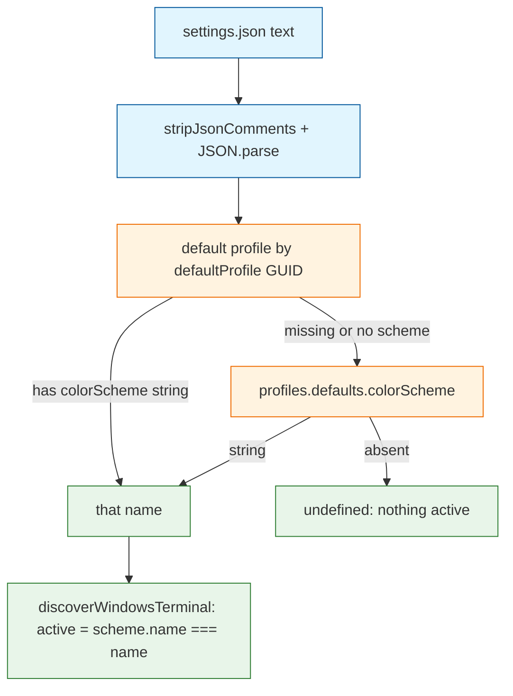

# Task: Detect Windows Terminal's active colorScheme

* Task ID: issue-10
* Complexity: Level 2
* Type: simple enhancement

Flag the scheme named by `profiles.defaults.colorScheme` or the default profile's `colorScheme` as `active`, following the Ghostty `activeGhosttyThemes` pattern. Per-profile schemes beyond the default profile stay out of scope.

Resolution is Windows Terminal inheritance, not two independent flags: a default-profile `colorScheme` wins over defaults when both are set. GUID compare is case-insensitive. Legacy `profiles` as an array is cheap and included.

## Test Plan (TDD)

### Behaviors to Verify

- Defaults only: settings with `profiles.defaults.colorScheme` and no scheme on the default profile → that name
- Default profile override: default profile has a different `colorScheme` than defaults → default profile's name
- Default profile inherits defaults: default profile exists without `colorScheme` → defaults name
- No scheme configured: valid settings with schemes but no `colorScheme` on defaults or the default profile → `undefined`
- Invalid / empty: unparseable JSONC, empty string, or missing `profiles` → `undefined`
- Legacy profiles array: `profiles` is an array; `defaultProfile` GUID matches an entry with `colorScheme` → that name
- GUID case: `defaultProfile` and profile `guid` differ only by case → still treated as the default profile
- Fixture document: representative JSONC `settings.json` with comments, two schemes, defaults, and a default profile → helper returns the expected in-use name; `parseWindowsTerminal` still returns both schemes
- Existing scheme parse: current Campbell inline test still extracts every scheme (no regression)

### Test Infrastructure

- Framework: Node `assert` harness in `test/parsers.test.ts`, run with `tsx` via `npm run test:parsers`
- Test location: `test/parsers.test.ts` (windows terminal section) and `test/fixtures/`
- Conventions: `test(name, fn)` plus `fix(filename)` for on-disk fixtures; Windows Terminal already has one inline JSONC parse test
- New test files: none for the runner. New fixture: `test/fixtures/windows-terminal-settings.json`
- Out of scope: filesystem `discoverThemes` tests (no harness today; tracked separately as issue #5). Discover wiring is `active: name === activeWindowsTerminalScheme(text)` against the helper contract above.

## Implementation Plan

### 1. Active scheme helper — executable

- Files: `src/parsers/iterm2.ts`, `test/parsers.test.ts`, `test/fixtures/windows-terminal-settings.json`

1. Stub tests: add empty `test(...)` cases under the existing `windows terminal` section for the behaviors listed above (skip the existing Campbell parse case; do not empty it).
2. Stub interface: export `activeWindowsTerminalScheme(text: string): string | undefined` from `src/parsers/iterm2.ts` with a doc comment in the file's existing style; body returns `undefined`.
3. Write tests and run red: implement assertions; add the JSONC fixture (comments, `defaultProfile`, `profiles.defaults`, `profiles.list` with two profiles, two named schemes). Run `npm run test:parsers` — new tests fail, Campbell parse still passes.
4. Write code and run green: implement the helper using `stripJsonComments` + `JSON.parse` (same as `parseWindowsTerminal`). Collect `profiles.defaults.colorScheme` when it is a string. Resolve the default profile from `defaultProfile` against `profiles.list` or a legacy `profiles` array, GUID compare case-insensitive. Prefer the default profile's string `colorScheme`, else defaults. Wire `discoverWindowsTerminal` in `src/discover.ts` to import the helper and set `active: name === activeName` per source file. Run `npm run test:parsers` until green.

### 2. User and architecture docs — prose/policy

- Files: `README.md`, `memory-bank/systemPatterns.md`
- No tests: prose/policy artifact

1. README Formats table: Windows Terminal "Active theme detected" from `no` to yes via defaults / default profile `colorScheme`.
2. `systemPatterns.md`: drop Windows Terminal from the list of sources that do not report in use.

## Technology Validation

No new technology - validation not required

## Dependencies

- Existing `stripJsonComments` / `JSON.parse` path in `src/parsers/iterm2.ts`
- Existing `discoverWindowsTerminal` candidate paths (unchanged)
- Node `assert` + `tsx` parser harness

## Challenges & Mitigations

- Both defaults and the default profile name a scheme: treat as WT inheritance (profile wins). Issue text allows either source; choosing both with a documented winner avoids a taste stop.
- Helper tests pass while discover still hardcodes `active: false`: step 1.4 includes the discover one-liner in the same green pass.
- Fixture becomes a change-detector: tests assert helper return values and scheme names/counts, not the fixture file's full text.
- `LOCALAPPDATA` missing on macOS: discover still no-ops without it; tests never call discover.

## Pre-Mortem

- Plan tested the helper but Mirror still never sees an active WT theme: already covered by wiring discover in step 1.4, not a later optional step.
- Plan marked every profile's scheme active: stay on defaults + default profile only; do not walk `profiles.list` for other `colorScheme` values.
- Plan assumed `profiles` is always `{ defaults, list }`: legacy array is an explicit behavior and test.

## Status

- [x] Initialization complete
- [x] Test planning complete (TDD)
- [x] Implementation plan complete
- [x] Technology validation complete
- [x] Pre-Mortem complete
- [x] Preflight
- [x] Build
- [ ] QA
