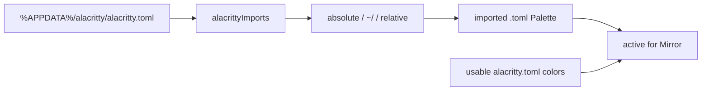

# Task: investigate-mobaxterm-themes

* Task ID: investigate-mobaxterm-themes
* Complexity: Level 2
* Type: simple enhancement (rework)

Rework: Alacritty Mirror on Windows. Theme files already parse; extraDirectories already lists them. Discovery never reads `%APPDATA%\alacritty\alacritty.toml` and never follows `import` / `[general].import`, so an import-only config (this machine: `msx.toml`) is never `active`. MobaXterm support stays as shipped.

## Test Plan (TDD)

### Behaviors to Verify

- `[general].import` array: that TOML → the listed path strings in order
- Top-level `import` array: same, when `[general].import` is absent
- `[general].import` wins when both keys exist
- Unparseable or missing import key → `[]`
- Resolve `~/themes/x.toml` against a home dir → that home path
- Resolve a relative spec against the config file's directory
- Windows-style `V:/Users/a/t.toml` is absolute (not joined to the config dir); `%APPDATA%\\...` is not expanded
- APPDATA discovery: `APPDATA/alacritty/alacritty.toml` that imports a usable theme → imported file is in the list, `active` true, config itself not active if it has no colors
- Inline colors: usable `alacritty.toml` with no imports remains `active` (Unix behavior preserved)
- Last usable import wins when several imports define palettes
- Missing import file is skipped; a later usable import can still be active
- extraDirs copy of the imported file is `active` when the resolved path matches
- Missing APPDATA / empty dirs → no throw

### Test Infrastructure

- Framework: Node `assert` harness via `tsx` (`npm run test:parsers`)
- Test location: `test/parsers.test.ts`, `test/discover.test.ts`, fixtures under `test/fixtures/`
- Conventions: existing Alacritty parser cases in `parsers.test.ts`; discovery uses `withFixtureHome` (already isolates `APPDATA`)
- New test files: none
- New fixtures: none required if tests write small TOML in the temp home; reuse `test/fixtures/extra/extra-alacritty.toml` as the imported theme body

## Implementation Plan

### 1. alacrittyImports and resolveAlacrittyImport — executable

- Files: `src/parsers/toml.ts`, `test/parsers.test.ts`

1. Stub tests: empty cases in `test/parsers.test.ts` for `[general].import`, top-level `import`, precedence, empty, `~/` resolve, relative resolve, Windows absolute, `%APPDATA%` not expanded
2. Stub interface: `export function alacrittyImports(text: string): string[]` returning `[]`; `export function resolveAlacrittyImport(spec: string, configFile: string, home: string): string` returning `spec`
3. Write tests and run red: inline TOML strings and path assertions as in the behavior list. `npx tsx test/parsers.test.ts` fails on empty stubs
4. Write code and run green: parse with existing `smol-toml`; if `general.import` is a string array use it, else top-level `import`; ignore non-string entries. Resolve: `~/` or `~\` → `path.join(home, rest)`; if `path.posix.isAbsolute(spec) || path.win32.isAbsolute(spec)` return spec unchanged; else `path.join(path.dirname(configFile), spec)`. Do not expand `%VAR%`. Re-run until green

### 2. discoverAlacritty Windows root and import active — executable

- Files: `src/discover.ts`, `test/discover.test.ts`

1. Stub tests: empty cases in `test/discover.test.ts` for APPDATA import-only config, inline `alacritty.toml` still active, last usable import, missing import skipped, extraDirs path match, missing dirs
2. Stub interface: extend `discoverAlacritty` signature stays `(extraDirs: string[]) => DiscoveredTheme[]`. Add `%APPDATA%\alacritty` to the bases list. Do not implement import following yet so the APPDATA test is red
3. Write tests and run red: `withFixtureHome`, set `APPDATA` to the temp home's `appdata`, write `alacritty/alacritty.toml` with `[general].import = ["themes/msx.toml"]` and copy `extra-alacritty.toml` to that relative path → imported origin listed, `active` true, `alacritty.toml` not in the usable-active set. Inline-colors case under XDG `alacritty/alacritty.toml` with no import still `active`. Two imports, first missing, second usable → second active. extraDirs: same file via realpath is active. Tests fail until import following ships
4. Write code and run green: bases include `path.join(process.env.APPDATA, 'alacritty')` when `APPDATA` is set. Walk `.toml` as today. After the walk, for every discovered or default-root `alacritty.toml`, read imports, resolve with `homeDir()` / `USERPROFILE` for `~/`, parse each import with `parseAlacritty`, skip missing/unusable. Add imported files not already seen (dedupe by resolved path). Active set: if a config file itself `isUsable`, it is active; otherwise the last usable import from that config is active. extraDirs entries with a matching resolved path inherit that flag. Re-run `test:parsers` until green

### 3. User and architecture docs — prose/policy

- Files: `README.md`, `STORE.md`, `memory-bank/productContext.md`, `memory-bank/systemPatterns.md`
- No tests: prose/policy artifact

1. Alacritty files row: Unix xdg/`~/.alacritty` plus `%APPDATA%\alacritty`
2. Active column: no longer only "`alacritty.toml` assumed active". Say: usable inline `alacritty.toml`, else last usable `import` / `[general].import`
3. Note Alacritty does not expand `%VAR%` in import paths; relative paths are from the config file

## Technology Validation

No new technology - validation not required

## Dependencies

- Existing `parseAlacritty`, `isUsable`, `walk`, `withFixtureHome` `APPDATA` isolation
- Alacritty 0.13+ `[general].import` and older top-level `import` (https://alacritty.org/config-alacritty.html)
- Windows config path `%APPDATA%\alacritty\alacritty.toml`

## Challenges & Mitigations

- Linux CI `path.isAbsolute('V:/Users/...')` is false: use `path.win32.isAbsolute` as well so Windows drive paths stay absolute in tests and on a ui-kind Windows host
- Import-only `alacritty.toml` is not `isUsable`: do not mark it active; add and flag the imported theme instead
- Composite merge (config overrides import field-by-field): if the config is usable, treat the config as the single Mirror palette; do not invent a merge table
- `%APPDATA%` in an import string: leave literal; Alacritty does the same
- extraDirs already listed the theme: dedupe by resolved path and set `active`, do not list twice

## Pre-Mortem

- We only added the APPDATA directory and still assumed `alacritty.toml` is active: Mirror would pick nothing on this machine. Plan response: unit 2 requires import following, not filename-only
- We treated `V:/...` as relative on Linux tests and thought resolution was wrong: already covered by Challenge (win32 absolute)
- We merged import+config palettes and drifted from `Palette` as a single-file parse: already covered by Challenge (config usable → config active, else last import)

## Status

- [x] Initialization complete
- [x] Test planning complete (TDD)
- [x] Implementation plan complete
- [x] Technology validation complete
- [x] Pre-Mortem complete
- [ ] Preflight
- [ ] Build
- [ ] QA
