# Task: ghostty-autodetect-pairs

* Task ID: ghostty-autodetect-pairs
* Complexity: Level 2
* Type: simple enhancement

Write Ghostty `theme = dark:X,light:Y` as a single apply unit: two `workbench.colorCustomizations` blocks scoped to the user's `workbench.preferredDarkColorTheme` and `workbench.preferredLightColorTheme`. Those are the themes `window.autoDetectColorScheme` actually switches between. Discovery already parses the pair; this task stamps the dark/light role, merges both palettes under those scopes, and has Mirror apply the pair instead of picking one half.

Replan after preflight FAIL (fixable): appearance stamping and preferred-theme selection now have vscode-free seams that tests call directly (`toGhosttyDiscovered`, `preferredPairScopes`).

```mermaid
graph LR
    classDef core fill:#e1f5fe,stroke:#01579b;
    classDef vscode fill:#fff3e0,stroke:#ef6c00;
    classDef disk fill:#f3e5f5,stroke:#7b1fa2;

    Config["Ghostty theme = dark:X,light:Y"]:::disk --> Stamp["toGhosttyDiscovered"]:::core
    Stamp --> Pair["activeGhosttyPair / mirrorCandidates"]:::core
    Pair --> Mirror["commandMirror"]:::vscode
    Mirror --> Apply["applyPalettePair"]:::vscode
    Apply --> Scopes["preferredPairScopes"]:::core
    Scopes --> Merge["mergePairedColors"]:::core
    Merge --> Settings["[preferredDark] and [preferredLight] blocks"]:::vscode
```

## Test Plan (TDD)

### Behaviors to Verify

- Stamp appearance: `toGhosttyDiscovered(entries, { dark: 'Broadcast', light: 'Ayu Light' })` → the Broadcast entry has `appearance: 'dark'` and `active: true`; Ayu Light has `appearance: 'light'`; an entry whose name is in neither side has no appearance and `active: false`
- Stamp single: `toGhosttyDiscovered(entries, { single: 'Broadcast' })` → Broadcast is `active: true` with no `appearance`
- Pair detect: two active Ghostty themes, one dark and one light → `activeGhosttyPair` returns both
- Pair absent: only one half present, or two actives from different sources, or a single `theme = X` → `activeGhosttyPair` returns `undefined`
- Mirror candidates: Ghostty dark+light plus another emulator's active theme → two candidates (the pair as one unit, plus the other); Ghostty pair alone → one candidate
- Preferred settings keys: `preferredPairScopes(read)` calls `read` with exactly `preferredDarkColorTheme` and `preferredLightColorTheme` (not `colorTheme`) and returns `pairScopes` of those values
- Pair scopes: `pairScopes('One Dark Pro', 'GitHub Light')` → `{ darkScope: '[One Dark Pro]', lightScope: '[GitHub Light]' }`
- Paired merge: two palettes plus those scope keys → `colorCustomizations` has `[One Dark Pro]` and `[GitHub Light]` objects with the mapped terminal keys, owned keys are `[One Dark Pro].terminal.background` (and the rest), never unscoped and never `[*Dark*]`
- Single merge unchanged: one palette with no scope → flat keys, owned keys without a `[Theme].` prefix (existing `applyPalette` shape)
- Owned-key regex: dual scoped owned keys remain matchable by the existing `removeApplied` scoped pattern `^(\[[^\]]+\])\.(.+)$`

### Test Infrastructure

- Framework: Node `assert` harness in `test/parsers.test.ts`, run with `tsx` via `npm run test:parsers`
- Test location: `test/`
- Conventions: `test(name, fn)` helper, `console.log` section headers, fixtures under `test/fixtures/`. No extension-host runner; tests must not import `vscode`.
- New test files: none. Add a `ghostty pair` / `colorCustomizations merge` section to `test/parsers.test.ts`.

## Implementation Plan

### 1. Pair identity — executable

- Files: `src/palette.ts`, `src/discover.ts`, `src/extension.ts`, `test/parsers.test.ts`

1. Stub tests: `toGhosttyDiscovered` with split active names, single active, and a non-matching entry; `activeGhosttyPair` (pair present, one half missing, mixed sources); `mirrorCandidates` collapsing a Ghostty pair so two halves are never two choices.
2. Stub interface: optional `appearance?: 'dark' | 'light'` on `DiscoveredTheme`; `toGhosttyDiscovered(entries, active)`; `activeGhosttyPair(themes)`; `mirrorCandidates(themes)` returning the pair (if any) plus other actives, without listing the pair's halves separately.
3. Write tests and run red: stamping assertions go through `toGhosttyDiscovered`, not hand-built `appearance` fields; a Ghostty pair plus a kitty active yields two candidates, not three.
4. Write code and run green: implement the helpers in `discover.ts`. `discoverGhostty` walks/parses then calls `toGhosttyDiscovered` — it must not stamp `appearance` inline. Point `commandMirror` at `mirrorCandidates`: apply the pair automatically when it is the only candidate; if others remain, offer the pair as one QuickPick row. Import picker stays single-theme.

### 2. Paired colorCustomizations merge — executable

- Files: `src/palette.ts`, `src/apply.ts`, `src/extension.ts`, `test/parsers.test.ts`

1. Stub tests: `pairScopes` brackets theme names; `preferredPairScopes` records the keys it reads and the scopes it returns; `mergePairedColors` under those scopes; `mergeColors` unscoped; leftover unrelated keys preserved; owned keys match `removeApplied`'s scoped regex.
2. Stub interface: `pairScopes(darkTheme, lightTheme)`; `preferredPairScopes(read: (key: string) => string | undefined)`; `mergeColors(current, colors, scopeKey?: string)`; `mergePairedColors(current, darkColors, lightColors, darkScope, lightScope)` returning `{ next, ownedKeys }`.
3. Write tests and run red: `preferredPairScopes` must request `preferredDarkColorTheme` and `preferredLightColorTheme` and must not request `colorTheme`; paired merge must not write unscoped `terminal.*` or wildcard scopes.
4. Write code and run green: implement the helpers in `palette.ts`. Point `applyPalette` at `mergeColors`. `applyPalettePair` calls `preferredPairScopes((key) => vscode.workspace.getConfiguration('workbench').get<string>(key))`, maps both palettes with `toColorCustomizations`, strips previously owned keys from `current`, merges with `mergePairedColors`, writes, records owned keys. Pair apply ignores `scopeToActiveTheme`. Do not set `window.autoDetectColorScheme`. When `commandMirror` selected a pair, call `applyPalettePair`.

### 3. Known-limit docs — prose/policy

- Files: `README.md`, `memory-bank/productContext.md`
- No tests: prose/policy artifact

1. Remove README "No light/dark pairing yet" and replace with what Mirror writes (preferred dark/light theme scopes) and that `window.autoDetectColorScheme` must already be on for OS switching.
2. Update the matching sentence in `memory-bank/productContext.md` Key Constraints.

## Technology Validation

No new technology - validation not required

## Dependencies

- Existing `activeGhosttyThemes` parse (already tested)
- Existing `toColorCustomizations` and `removeApplied` scoped-key regex
- VS Code settings `workbench.preferredDarkColorTheme` / `workbench.preferredLightColorTheme` (read at apply time through `preferredPairScopes`; [docs](https://code.visualstudio.com/docs/configure/themes#_automatically-switch-based-on-os-appearance))

## Challenges & Mitigations

- Wrong scope keys (`[*Dark*]` wildcards miss themes without those words; hardcoding `Default Dark+` breaks post-1.86 defaults): `preferredPairScopes` is the only settings-to-scope path; tests assert the exact key names it reads.
- Appearance never stamped because tests built `DiscoveredTheme`s by hand: `toGhosttyDiscovered` is the only stamper; `discoverGhostty` must call it.
- Mirror still asks the user to pick Broadcast vs Ayu Light: `mirrorCandidates` collapses them; extension must not list the halves separately.
- `apply.ts` cannot be imported from `test:parsers` (`vscode`): key-shape and settings-key tests target vscode-free helpers; `applyPalettePair` only supplies the vscode `get` closure.
- Prior flat import left unscoped `terminal.*` that would sit under the scoped pair: `applyPalettePair` strips previously owned keys before merging.

## Pre-Mortem

- Tests pass on merge helpers but Mirror still applies one half because grouping never reached `commandMirror`: step 1 write-code includes pointing `commandMirror` at `mirrorCandidates`.
- `applyPalettePair` reads `workbench.colorTheme` instead of preferred dark/light: `preferredPairScopes` tests fail unless those two key names are requested; apply must pass `workbench.get` through that helper, not pick the key names itself.
- Enabling `window.autoDetectColorScheme` from the extension surprises users who keep a fixed theme: already out of scope; README states the prerequisite.

## Status

- [x] Initialization complete
- [x] Test planning complete (TDD)
- [x] Implementation plan complete
- [x] Technology validation complete
- [x] Pre-Mortem complete
- [x] Preflight
- [ ] Build
- [ ] QA
