# Task: ghostty-autodetect-pairs

* Task ID: ghostty-autodetect-pairs
* Complexity: Level 2
* Type: simple enhancement

Write Ghostty `theme = dark:X,light:Y` as a single apply unit: two `workbench.colorCustomizations` blocks scoped to the user's `workbench.preferredDarkColorTheme` and `workbench.preferredLightColorTheme`. Those are the themes `window.autoDetectColorScheme` actually switches between. Discovery already parses the pair; this task stamps the dark/light role, merges both palettes under those scopes, and has Mirror apply the pair instead of picking one half.

```mermaid
graph LR
    classDef core fill:#e1f5fe,stroke:#01579b;
    classDef vscode fill:#fff3e0,stroke:#ef6c00;
    classDef disk fill:#f3e5f5,stroke:#7b1fa2;

    Config["Ghostty theme = dark:X,light:Y"]:::disk --> Discover["discoverGhostty stamps appearance"]:::core
    Discover --> Pair["activeGhosttyPair"]:::core
    Pair --> Mirror["commandMirror"]:::vscode
    Mirror --> Apply["applyPalettePair"]:::vscode
    Apply --> Merge["mergePairedColors"]:::core
    Merge --> Settings["[preferredDark] and [preferredLight] blocks"]:::vscode
```

## Test Plan (TDD)

### Behaviors to Verify

- Stamp appearance: Ghostty discovery input with `active.dark` / `active.light` matching theme names → those `DiscoveredTheme`s carry `appearance: 'dark' | 'light'`
- Pair detect: two active Ghostty themes, one dark and one light → `activeGhosttyPair` returns both
- Pair absent: only one half present, or two actives from different sources, or a single `theme = X` → `activeGhosttyPair` returns `undefined`
- Mirror candidates: Ghostty dark+light plus another emulator's active theme → two candidates (the pair as one unit, plus the other); Ghostty pair alone → one candidate
- Paired merge: two palettes plus dark/light scope names → `colorCustomizations` has `[Dark Theme]` and `[Light Theme]` objects with the mapped terminal keys, and owned keys are `[Dark Theme].terminal.background` (and the rest), never unscoped
- Single merge unchanged: one palette with no scope → flat keys, owned keys without a `[Theme].` prefix (existing `applyPalette` shape)
- Owned-key regex: dual scoped owned keys remain matchable by the existing `removeApplied` scoped pattern `^(\[[^\]]+\])\.(.+)$`

### Test Infrastructure

- Framework: Node `assert` harness in `test/parsers.test.ts`, run with `tsx` via `npm run test:parsers`
- Test location: `test/`
- Conventions: `test(name, fn)` helper, `console.log` section headers, fixtures under `test/fixtures/`. No extension-host runner; tests must not import `vscode`.
- New test files: none. Add a `ghostty pair` / `colorCustomizations merge` section to `test/parsers.test.ts`.

## Implementation Plan

### 1. Pair identity — executable

- Files: `src/palette.ts`, `src/discover.ts`, `src/extension.ts`, `test/parsers.test.ts`

1. Stub tests: cases for `appearance` on constructed themes; `activeGhosttyPair` (pair present, one half missing, mixed sources, single active); `mirrorCandidates` collapsing a Ghostty pair into one unit so two halves are never two choices.
2. Stub interface: add optional `appearance?: 'dark' | 'light'` on `DiscoveredTheme`; export `activeGhosttyPair(themes: DiscoveredTheme[]): { dark: DiscoveredTheme; light: DiscoveredTheme } | undefined` and `mirrorCandidates(themes: DiscoveredTheme[])` that returns the pair (if any) plus other actives, without listing the pair's halves separately.
3. Write tests and run red: assert pair grouping is name-and-role based, not "any two active Ghostty themes"; a Ghostty pair plus a kitty active yields two candidates, not three.
4. Write code and run green: stamp `appearance` in `discoverGhostty` from `activeGhosttyThemes`; implement the helpers in `discover.ts` (vscode-free). Point `commandMirror` at `mirrorCandidates`: apply the pair automatically when it is the only candidate; if others remain, offer the pair as one QuickPick row alongside them. Import picker stays single-theme.

### 2. Paired colorCustomizations merge — executable

- Files: `src/palette.ts`, `src/apply.ts`, `src/extension.ts`, `test/parsers.test.ts`

1. Stub tests: merge two palettes into an existing customizations object under `[Dark]` / `[Light]`; merge one palette unscoped; owned-key lists for both paths; leftover unrelated keys preserved.
2. Stub interface: `mergeColors(current, colors, scopeKey?: string)` and `mergePairedColors(current, darkColors, lightColors, darkScope, lightScope)` returning `{ next, ownedKeys }`. Scopes are the already-bracketed keys (`[Default Dark Modern]`), matching today's `applyPalette`.
3. Write tests and run red: paired path must not write unscoped `terminal.*`; owned keys must use `scope.inner` so `removeApplied` can delete them.
4. Write code and run green: implement merge in `palette.ts` (vscode-free). Point `applyPalette` at `mergeColors`. Add `applyPalettePair` in `apply.ts` that reads `workbench.preferredDarkColorTheme` and `workbench.preferredLightColorTheme`, maps both palettes with `toColorCustomizations`, strips previously owned keys from `current` so a prior flat import cannot linger unscoped, merges, writes, records owned keys. Pair apply ignores `scopeToActiveTheme` — the pair *is* the scoping. Do not set `window.autoDetectColorScheme`; the blocks are keyed for it, not a workbench-policy change. When `commandMirror` selected a pair, call `applyPalettePair`.

### 3. Known-limit docs — prose/policy

- Files: `README.md`, `memory-bank/productContext.md`
- No tests: prose/policy artifact

1. Remove README "No light/dark pairing yet" and replace with what Mirror writes (preferred dark/light theme scopes) and that `window.autoDetectColorScheme` must already be on for OS switching.
2. Update the matching sentence in `memory-bank/productContext.md` Key Constraints.

## Technology Validation

No new technology - validation not required

## Dependencies

- Existing `activeGhosttyThemes` parse (already tested)
- Existing `toColorCustomizations` and `removeApplied` scoped-key regex
- VS Code settings `workbench.preferredDarkColorTheme` / `workbench.preferredLightColorTheme` (read at apply time; [docs](https://code.visualstudio.com/docs/configure/themes#_automatically-switch-based-on-os-appearance))

## Challenges & Mitigations

- Wrong scope keys (`[*Dark*]` wildcards miss themes without those words; hardcoding `Default Dark+` breaks post-1.86 defaults): read preferred dark/light theme names at apply time; tests inject explicit scope strings into merge.
- Mirror still asks the user to pick Broadcast vs Ayu Light: `activeGhosttyPair` collapses them; extension must not list the halves separately.
- `apply.ts` cannot be imported from `test:parsers` (`vscode`): all observable key-shape tests target vscode-free merge/pair helpers.
- Prior flat import left unscoped `terminal.*` that would sit under the scoped pair: `applyPalettePair` strips previously owned keys before merging.

## Pre-Mortem

- Tests pass on merge helpers but Mirror still applies one half because grouping never reached `commandMirror`: step 1 write-code includes pointing `commandMirror` at `mirrorCandidates`; preflight/QA should read that call site.
- Scopes written to the current `workbench.colorTheme` instead of preferred dark/light: that would not follow auto-detect. Plan forbids `scopeToActiveTheme` on the pair path.
- Enabling `window.autoDetectColorScheme` from the extension surprises users who keep a fixed theme: already out of scope; README states the prerequisite.

## Status

- [x] Initialization complete
- [x] Test planning complete (TDD)
- [x] Implementation plan complete
- [x] Technology validation complete
- [x] Pre-Mortem complete
- [ ] Preflight
- [ ] Build
- [ ] QA
