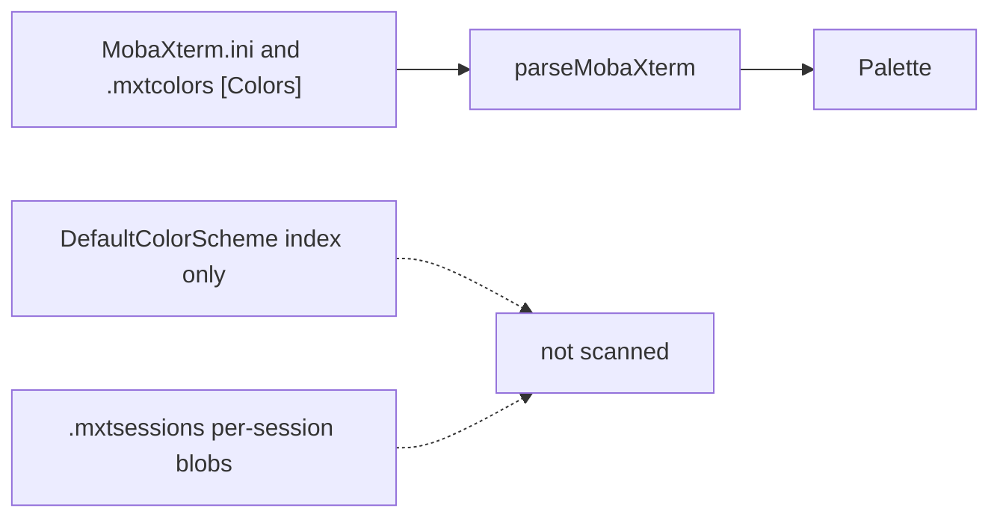

# Task: investigate-mobaxterm-themes

* Task ID: investigate-mobaxterm-themes
* Complexity: Level 2
* Type: simple enhancement

MobaXterm palettes are on disk, not buried. Global and imported themes live in an INI `[Colors]` section (`Black=r,g,b` … `BoldWhite`, plus `ForegroundColour` / `BackgroundColour` / `CursorColour`) inside `MobaXterm.ini` or standalone `.mxtcolors` / `.ini` theme files. That is the same class of file Termeleon already reads for Windows Terminal and Xresources.

Built-in dropdown schemes that exist only as `DefaultColorScheme=N` with no RGB keys, and per-session colors packed into undocumented `.mxtsessions` `%` fields, are not scanned. Syntax highlighting (`SyntaxType`) is not an ANSI palette.

## Test Plan (TDD)

### Behaviors to Verify

- Parse `[Colors]` RGB triples: a `[Colors]` section with the 16 named slots and Colour keys → `Palette` with `#rrggbb` ansi[0..15], background, foreground, cursor
- Ignore other INI sections: keys outside `[Colors]` do not become palette slots
- Incomplete file: `[Colors]` with only `DefaultColorScheme` (no 16 RGB slots) → palette is not `isUsable`
- Malformed RGB: empty, non-numeric, or out-of-range component → that slot is undefined
- Default-path discovery: `USERPROFILE/Documents/MobaXterm/MobaXterm.ini` with a usable `[Colors]` → one theme, `source` `mobaxterm`, `active` true
- AppData discovery: `APPDATA/MobaXterm/MobaXterm.ini` is found when Documents is absent
- extraDirs walk: a `.mxtcolors` or `.ini` theme file under `extraDirs` → listed, `active` false, origin under that directory
- Missing sources: no MobaXterm files and no extraDirs → empty list, no throw
- Extension filter: `.mxtsessions` next to a valid theme is not parsed as a palette
- Sources enum: `discoverThemes({ sources: ['mobaxterm'] })` returns only that source; `termeleon.sources` enum includes `mobaxterm`

### Test Infrastructure

- Framework: Node `assert` harness via `tsx` (`npm run test:parsers`)
- Test location: `test/parsers.test.ts`, `test/discover.test.ts`, fixtures under `test/fixtures/`
- Conventions: `test('name', () => { ... })`; parser cases read `fix('filename')`; discovery uses `withFixtureHome` and asserts on `origin` under the fixture tree
- New test files: none
- New fixtures: `test/fixtures/mobaxterm-colors.ini` (synthetic `[Colors]` plus a decoy section), `test/fixtures/mobaxterm-index-only.ini` (DefaultColorScheme only)

## Implementation Plan

### 1. parseMobaXterm — executable

- Files: `src/parsers/mobaxterm.ts`, `test/parsers.test.ts`, `test/fixtures/mobaxterm-colors.ini`, `test/fixtures/mobaxterm-index-only.ini`

1. Stub tests: empty cases in `test/parsers.test.ts` for RGB parse, other-section ignore, index-only unusable, malformed RGB
2. Stub interface: `export function parseMobaXterm(text: string): Palette` in `src/parsers/mobaxterm.ts` returning `{ ansi: new Array(16).fill(undefined) }`
3. Write tests and run red: fixture with distinctive `r,g,b` (including spaced triples and `;` comments) asserts `#010203`-style slots; full INI with `[Misc]` decoy; index-only `isUsable` false; `not-a-color` / `256,0,0` slots undefined. `npx tsx test/parsers.test.ts` (or the mobaxterm section) fails because the stub returns an empty palette
4. Write code and run green: parse only the `[Colors]` section (INI section headers, `;` / `#` comments, CRLF). Map `Black`/`BoldBlack`/… and `ForegroundColour`/`BackgroundColour`/`CursorColour` (also accept `Color` spelling). Convert `r,g,b` 0–255 decimals to `#rrggbb` and pass through `normalizeColor`. Do not extend `normalizeColor` to raw triples. Re-run until green

### 2. discoverMobaXterm — executable

- Files: `src/discover.ts`, `src/extension.ts`, `package.json`, `test/discover.test.ts`, `test/parsers.test.ts`

1. Stub tests: empty cases in `test/discover.test.ts` for Documents path, AppData fallback, extraDirs `.mxtcolors`/`.ini`, missing files, skipped `.mxtsessions`; empty case in `test/parsers.test.ts` that `termeleon.sources` items.enum includes `mobaxterm`
2. Stub interface: `function discoverMobaXterm(extraDirs: string[]): DiscoveredTheme[]` returning `[]`; wire `run('mobaxterm', () => discoverMobaXterm(extraDirs))` in `discoverThemes`; add `mobaxterm` to `package.json` `termeleon.sources` enum and keywords, and `SOURCE_LABELS` in `src/extension.ts`. Extend `stem()` to strip `.ini` and `.mxtcolors`. Extend `withFixtureHome` to save/delete `USERPROFILE` and `APPDATA`
3. Write tests and run red: set `USERPROFILE` to the temp home and write `Documents/MobaXterm/MobaXterm.ini` from the colors fixture → origin match, `active` true, name `MobaXterm`; AppData-only case; extraDirs origin under the extra dir, `active` false; `.mxtsessions` sibling ignored; missing dirs do not throw. Tests fail because discovery still returns `[]`
4. Write code and run green: scan `path.join(USERPROFILE or homedir, 'Documents', 'MobaXterm')` and `path.join(APPDATA, 'MobaXterm')` plus `extraDirs`; walk for `.ini` and `.mxtcolors` only; `readText` + `parseMobaXterm` + `isUsable`; `MobaXterm.ini` from those default roots is `active`; extraDirs copies are not. Deduplicate by resolved path. Do not search Program Files or parse `.mxtsessions`. Re-run `test:parsers` until green

### 3. User and architecture docs — prose/policy

- Files: `README.md`, `STORE.md`, `memory-bank/productContext.md`, `memory-bank/systemPatterns.md`
- No tests: prose/policy artifact

1. Add MobaXterm to the supported-emulator lists: default files (`%USERPROFILE%\Documents\MobaXterm\MobaXterm.ini`, `%APPDATA%\MobaXterm\MobaXterm.ini`), extraDirs for `.mxtcolors` / theme `.ini`, active = global `MobaXterm.ini` `[Colors]`
2. Known limits: unused built-in schemes that exist only as `DefaultColorScheme` indexes are not scanned (same class as Windows Terminal `defaults.json`); per-session `.mxtsessions` colors are not scanned; portable INI next to the exe is extraDirs-only; syntax highlighting is not a palette
3. Semantic mismatches: MobaXterm `r,g,b` decimals and British `Colour` keys
4. systemPatterns: MobaXterm is a walkable format and must take `extraDirs`; default roots stay on the two Windows config directories

## Technology Validation

No new technology - validation not required

## Dependencies

- Existing `Palette` / `normalizeColor` / `isUsable`
- Existing `walk` / `readText` / `discoverThemes` / `extraDirs`
- Published INI `[Colors]` layout (Catppuccin `.mxtcolors`, iTerm2-Color-Schemes `mobaxterm/*.ini`, Dracula `MobaXterm.ini`)
- Windows `USERPROFILE` and `APPDATA` at scan time (ui-kind host). Linux CI uses extraDirs and mocked env, same as Windows Terminal `LOCALAPPDATA`

## Challenges & Mitigations

- Built-in scheme is only an index: if `[Colors]` lacks 16 RGB keys, `isUsable` drops it. Document as a known gap; do not vendor compiled presets
- extraDirs `.ini` false positives: only `.ini` and `.mxtcolors`, and only palettes that survive `isUsable` after `[Colors]` parse
- `.mxtsessions` encoding is version-dependent and undocumented: do not parse; document
- UTF-16 `MobaXterm.ini`: community theme files are UTF-8; `readText` is utf8 like every other source. If a real file is UTF-16, discovery misses it — same failure mode as a missing file, not a crash. Do not add a second decoder unless a fixture proves it
- Portable edition INI beside the exe: no reliable install path; extraDirs is the escape hatch
- Default-path tests on Linux CI: mock `USERPROFILE`/`APPDATA` inside `withFixtureHome`; keep an extraDirs case so discovery is exercised without Windows env

## Pre-Mortem

- We documented a gap and skipped the parser even though `[Colors]` is public and already used by theme packs: plan response — implement parser + discovery (steps 1–2); docs only for the index and session leftovers
- We treated `.mxtsessions` as in-scope and spent the build on a brittle `%`-field decoder: already covered by Challenge (sessions out of scope)
- We extended `normalizeColor` to `r,g,b` and broke unrelated parsers: already covered by Step 1 (convert in `parseMobaXterm` only)
- Default-path discovery is untested on CI because `USERPROFILE` is unset: already covered by Challenge (mock env + extraDirs)

## Status

- [x] Initialization complete
- [x] Test planning complete (TDD)
- [x] Implementation plan complete
- [x] Technology validation complete
- [x] Pre-Mortem complete
- [ ] Preflight
- [ ] Build
- [ ] QA
