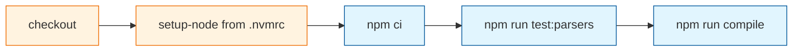

# Task: GitHub Actions CI

* Task ID: github-actions-ci
* Complexity: Level 2
* Type: simple enhancement

Add GitHub Actions on `pull_request` and `push` to `main` so a PR that breaks a parser test or typecheck fails CI. Shape matches other Texarkanine Node repos, closest [tab-yeet `ci.yaml`](https://github.com/Texarkanine/tab-yeet/blob/main/.github/workflows/ci.yaml): checkout, `setup-node` from `.nvmrc` with npm cache, `npm ci`, then this repo's scripts. No REUSE, Codecov, or `vsce package`. Spec: https://github.com/Texarkanine/vscode-terminal-themes/issues/3

## Test Plan (TDD)

### Behaviors to Verify

- Lockfile present: repo root has `package-lock.json` → `npm ci` has a lockfile to consume
- Node pin present: `.nvmrc` exists and its first non-comment line is a Node version (`setup-node`'s `node-version-file` can read it)
- CI contract: `.github/workflows/ci.yaml` triggers on `pull_request` and `push` to `main`, uses `node-version-file: .nvmrc` with npm cache, and runs `npm ci`, `npm run test:parsers`, and `npm run compile`
- Edge: a workflow that omits `test:parsers` or `compile` → contract test fails (CI would otherwise go green while the issue's gate is gone)
- Edge: no lockfile → contract test fails (`npm ci` cannot run)
- Out of scope, not tested: REUSE, Codecov, vsce (absence assertions would be change-detectors)

These are cross-file contracts (lockfile / nvmrc / workflow vs the commands CI must run), not change-detectors on wording. Do not assert job names, action major versions, or the absence of future optional jobs.

No new product parser/compile behavior. Existing `test:parsers` cases stay as they are.

### Test Infrastructure

- Framework: existing Node `assert` harness in `test/parsers.test.ts` (`test()` helper, `tsx` via `npm run test:parsers`)
- Test location: `test/parsers.test.ts` (add a `ci` section; do not add a second runner)
- Conventions: `test('name', () => { assert... })`; files read from disk; no `vscode`
- New test files: none

## Implementation Plan

### 1. CI contract — executable

- Files: `test/parsers.test.ts`, `.nvmrc`, `package-lock.json`, `.github/workflows/ci.yaml`

1. Stub tests: in `test/parsers.test.ts`, add a `ci` section with empty cases named for lockfile present, `.nvmrc` pin, and workflow contract.
2. Stub interface: no new functions. Do not create the workflow, `.nvmrc`, or lockfile yet.
3. Write tests and run red: lockfile exists at repo root; `.nvmrc` first non-comment line matches `/^\d+(\.\d+)*$/`; workflow file contains `pull_request`, `push`, `main`, `node-version-file`, `.nvmrc`, `cache: npm` (or `cache: "npm"`), `npm ci`, `npm run test:parsers`, and `npm run compile`. Run `npm run test:parsers`; new cases fail.
4. Write code and run green:
    - Write `.nvmrc` with `22` (major-only like tab-yeet's `24`; this machine's nvm default is 22.x; a16n is 22.22.1).
    - Generate `package-lock.json` with Node 22 (`nvm use` / the `.nvmrc` version), then confirm `npm ci` succeeds.
    - Add `.github/workflows/ci.yaml` modeled on tab-yeet: `actions/checkout@v7`, `actions/setup-node@v7` with `node-version-file: ".nvmrc"` and `cache: npm`, then `npm ci`, `npm run test:parsers`, `npm run compile`. Copy neither Codecov, coverage, REUSE, nor vsce/package steps.
    - Re-run `npm run test:parsers` (green) and `npm run compile` (green).

### 2. Contributor docs and tech context — prose/policy

- Files: `README.md`, `memory-bank/techContext.md`
- No tests: prose/policy artifact

1. README Development: document `npm ci` (lockfile now exists) alongside `test:parsers` and `compile`.
2. `techContext.md`: replace "there is no package-lock.json" with the lockfile + `.nvmrc` + GitHub Actions facts.

## Technology Validation

No new npm dependencies. Workflow uses `actions/checkout@v7` and `actions/setup-node@v7`, already in tab-yeet and a16n. Validation is generating the lockfile on Node 22 and running `npm ci`, `npm run test:parsers`, and `npm run compile` locally.

## Dependencies

- Node 22 available locally to generate the lockfile (nvm default 22.23.2 on this machine; Homebrew node 26 must not be the generator)
- GitHub-hosted `ubuntu-latest` runners (no repo setting required for a public Actions workflow)

## Challenges & Mitigations

- Lockfile generated with Homebrew Node 26, CI on 22 fails or drifts: generate with `nvm use` from `.nvmrc` (or `source nvm` + Node 22), not `/opt/homebrew/bin/node`.
- Copy-paste from tab-yeet pulls in Codecov/coverage or from a16n pulls in pnpm/REUSE: the workflow step lists the exact steps to include and the jobs to omit.
- Contract tests over-specify YAML and fail on harmless reformat: assert only triggers, `.nvmrc`/npm cache, and the three commands.

## Pre-Mortem

- CI copied tab-yeet too faithfully and required Codecov or `test:coverage` this repo does not have: already covered by Challenge 2; the write-green substep names the omit list.
- Contract tests become change-detectors on comments or `name:` strings: already covered by Challenge 3.
- Wrong layer: treating GitHub YAML as product code that needs a YAML parser dependency: do not add a YAML library; substring/contract checks in the existing harness are enough.
- `Fixes #3` never lands on a commit: the build phase's feature commit (not the Niko chore checkpoints) includes `Fixes #3`.

## Status

- [x] Initialization complete
- [x] Test planning complete (TDD)
- [x] Implementation plan complete
- [x] Technology validation complete
- [x] Pre-Mortem complete
- [x] Preflight
- [ ] Build
- [ ] QA
