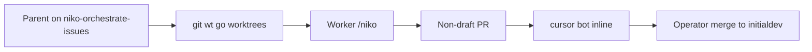

# TASK ARCHIVE: Orchestrate issue workers

## SUMMARY

Parent Niko on `niko-orchestrate-issues` ran eight parallel workers in `git wt` worktrees off `initialdev`. Each worker implemented one GitHub issue through `/niko` to a non-draft PR. The operator merged all eight: #11, #12, #13, #14, #15, #16, #17, #18. Issues #4 (live F5 picker) and #8 (Marketplace publisher id) stayed with the human.

## REQUIREMENTS

- One worker per issue: #1, #2, #3, #5, #6, #7, #9, #10.
- Worktrees via `git wt go`; printed path is the only tree. Workers run OptMem and SumMem.
- Non-draft PRs. Judge `cursor[bot]` **inline** review comments, not the walkthrough body.
- Skip #4 and #8.

## IMPLEMENTATION

Parent did not change product code. Overlap on `discover.ts`, tests, and `package.json` was expected; the operator merged in order (#12, then #15, then #17) and the parent resolved each dirty PR against the new `initialdev` tip.

| Issue | PR | Outcome |
|---|---|---|
| #1 kitty comments | [#11](https://github.com/Texarkanine/vscode-terminal-themes/pull/11) | merged |
| #2 extraDirectories | [#12](https://github.com/Texarkanine/vscode-terminal-themes/pull/12) | merged |
| #3 CI | [#15](https://github.com/Texarkanine/vscode-terminal-themes/pull/15) | merged |
| #5 discover tests | [#16](https://github.com/Texarkanine/vscode-terminal-themes/pull/16) | merged |
| #6 host tests | [#17](https://github.com/Texarkanine/vscode-terminal-themes/pull/17) | merged |
| #7 release-please | [#14](https://github.com/Texarkanine/vscode-terminal-themes/pull/14) | merged |
| #9 Ghostty pairs | [#18](https://github.com/Texarkanine/vscode-terminal-themes/pull/18) | merged |
| #10 WT active scheme | [#13](https://github.com/Texarkanine/vscode-terminal-themes/pull/13) | merged |

Parent `/niko-qa` and `/niko-reflect` were not run: there was no product surface in this checkout, and the operator closed the task after the last merge.

## TESTING

Workers owned TDD in their trees. After each conflict merge, this parent re-ran `npm run test:parsers` and `npm run compile`; #17 also re-ran `npm run test:host` (18 passing). GitHub CI on #15/#17 ran `npm ci` plus parsers and compile.

## LESSONS LEARNED

- zsh `wt` cds; `git wt go` only prints `~/worktrees/Texarkanine/vscode-terminal-themes/vscode-terminal-themes-<branch>`.
- After a `git wt go` in a persistent Cursor shell, restore `PATH` if `git` vanishes.
- `cursor[bot]` findings are inline review comments, not the review-body walkthrough.
- Parallel branches that both add `package-lock.json` should regenerate the lockfile from a **clean** tree (no `node_modules`) so npm 10 keeps other-platform optional esbuild for linux CI.
- Later PRs vs a just-merged `initialdev` often conflict only in `memory-bank/techContext.md` once product files have already auto-merged.
- Closing the last `});` of a parsers.test.ts conflict lives on the far side of `>>>>>>>`; stripping it as a leftover marker leaves `Unexpected end of file`.

## PROCESS IMPROVEMENTS

- Land overlapping PRs one at a time; do not wait until all eight are dirty.
- Own `package-lock.json` on the PR that first needs `npm ci` or new test runners, not on every branch.
- Parent preflight is noise for a no-code orchestration; skip it when the operator already approved the issue list.

## TECHNICAL IMPROVEMENTS

None beyond what the worker PRs already landed.

## NEXT STEPS

- #4 still needs a real-host picker pass.
- #8 still needs a Marketplace publisher id.
- `origin/main` is an unrelated `Initial commit` (README only). It is not a fast-forward of `initialdev`.
