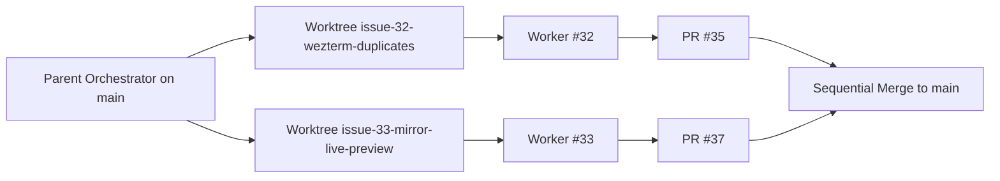

# TASK ARCHIVE: Orchestrate Issue 32 and Issue 33 Workers

## SUMMARY

Parent Niko orchestrated two parallel worker agents running in isolated `git wt` worktrees off `main` to address GitHub issues #32 and #33. Both workers followed strict TDD and Niko archive procedures, opened non-draft pull requests ([PR #35](https://github.com/Texarkanine/termeleon/pull/35) and [PR #37](https://github.com/Texarkanine/termeleon/pull/37)), passed all CI checks, and were sequentially merged into `main`.

## REQUIREMENTS

- One worker per issue:
  - Issue #32: WezTerm duplicate theme discovery due to nested directory walking.
  - Issue #33: Live preview support in mirror command when choosing among multiple active themes.
- Worktrees provisioned via `git wt go`.
- Workers execute full TDD and Niko lifecycle in their worktrees with OptMem and SumMem initialized.
- Non-draft PRs opened with CI passing and inline review feedback resolved.
- Parent reconciles and merges PRs, runs full test and build verification suite on `main`, and tears down worktrees.

## IMPLEMENTATION

| Issue | PR | Outcome |
|---|---|---|
| #32 WezTerm duplicates | [#35](https://github.com/Texarkanine/termeleon/pull/35) | merged |
| #33 Mirror live preview | [#37](https://github.com/Texarkanine/termeleon/pull/37) | merged |

- Issue #32 was resolved in `src/discover.ts` by tracking visited files in a `Set<string>` during directory traversal.
- Issue #33 was resolved in `src/apply.ts` and `src/extension.ts` by adding `LivePreview.schedulePair`, creating `pickMirrorCandidate`, wiring QuickPick active change events to live preview, and ensuring terminal visibility.

## TESTING

Each worker owned TDD within its worktree:
- Worker #32 added unit discovery regression test in `test/discover.test.ts`.
- Worker #33 added preview and picker host integration tests in `test/host/preview.test.ts` and `test/host/picker.test.ts`.

Parent verified on `main` after merging both PRs:
- `npm run compile`: Clean build and bundle with esbuild.
- `npm run test:parsers`: 54 parser/CI/contract tests + 6 discovery tests passed (60 passing).
- `npm run test:host`: 37 extension host tests passed (0 failures).
- `npm run test:coverage`: Full coverage report generated.

## LESSONS LEARNED

- Worktree isolation completely prevents file collisions and git index lock contention during parallel worker runs.
- Shared OptMem repository store and committed SumMem notes allow cross-pollination of knowledge across parallel sessions without interference.

## NEXT STEPS

None. Both issues #32 and #33 are resolved and merged to `main`.
