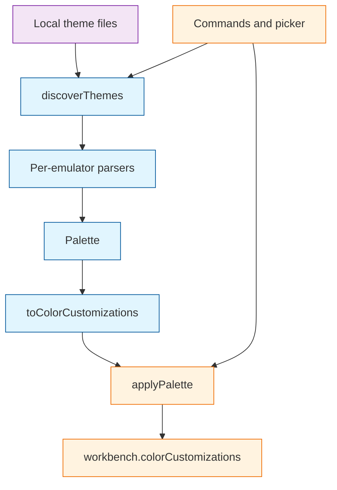

# System Patterns

## How This System Works

This is a VS Code UI-kind extension whose job is to copy a palette from files on the local disk into `workbench.colorCustomizations`. It does not contribute a color theme. The load-bearing split is:

- **vscode-free core** (`src/discover.ts`, `src/palette.ts`, `src/parsers/`): scan the filesystem, parse emulator formats, emit a `Palette`. These modules must not import `vscode`. That is what makes `npm run test:parsers` possible without an extension host, and what would let the same code become a CLI later.
- **vscode-bound shell** (`src/extension.ts`, `src/apply.ts`): commands, the QuickPick, and writing/restoring settings. `apply.ts` is the only module that mutates configuration.

Every emulator format collapses onto one `Palette`. Mapping to VS Code keys happens once, in `toColorCustomizations`. Adding a format means a parser plus a discovery function; it must not grow a second mapping table.

Discovery never throws. A broken or missing source is simply absent from the list. A theme with fewer than 16 ANSI slots is dropped (`isUsable`), so partial files never reach the picker.

Writes are real, including live preview. Preview applies the palette to settings and restores a snapshot on cancel. Surgical removal depends on an owned-key list stored in extension state, keyed to the same target (user vs workspace) as the write. If that state is gone, removal falls back to the full set of terminal keys and the UI must confirm first.

Violating the vscode-free boundary (importing `vscode` into a parser or into discovery) makes the parser tests unrunnable and couples format work to the extension host. Writing keys that are not recorded in owned state makes removal either a no-op or a destructive fallback. Changing `extensionKind` away from `ui` makes discovery scan the remote filesystem instead of the user's theme files.

## Canonical Palette Hub

`Palette` in `src/palette.ts` is the only contract between formats and VS Code. Parsers emit it; apply consumes it. Semantic mismatches (Ghostty `cursor-color` vs VS Code `terminalCursor.foreground`, Windows Terminal `purple` vs magenta, Alacritty `0xrrggbb`, iTerm2 0..1 floats) are resolved at parse or map time, not in the UI.

## vscode-Free Core

`discover.ts`, `palette.ts`, and `src/parsers/*` use Node `fs` / `os` / `path` only. `extension.ts` and `apply.ts` are the vscode-importing surface. Parser tests in `test/parsers.test.ts` import the core directly and run with `tsx`. vscode-bound apply, remove, and live-preview behavior is covered by Mocha tests under `test/host/` in an Extension Development Host.

## Surgical Settings Ownership

`applyPalette` merges into `workbench.colorCustomizations` at exactly one `ConfigurationTarget` (read via `inspect`, not the merged value) and records the keys it wrote in `terminalThemeImport.ownedKeys` on `globalState` or `workspaceState` to match that target. `removeApplied` deletes only those keys. Empty owned state plus `allowFallback` sweeps `managedKeys()` and, in fallback, also inside theme-scoped `[Theme Name]` blocks.

## Live Preview Is Real Writes

The picker does not use a scratch overlay. Arrowing through items schedules `LivePreview` (`src/apply.ts`), which debounces real `applyPalette` writes. `cancel()` restores the pre-session snapshot. `stop()` drops a pending timer without restoring — accept must call it, or a leftover apply can overwrite a Remove inside the debounce window. Turning `livePreview` off skips the write-on-arrow path. Host tests drive `LivePreview` directly; they do not automate the QuickPick.

## UI-Kind Local Filesystem

`package.json` sets `extensionKind` to `["ui"]` so the extension always runs on the local machine. Discovery paths are home, XDG, and (on macOS) Application Support / app-bundle theme directories. A remote extension host would scan a machine that does not have the user's emulator configs.

## Best-Effort Discovery

`discoverThemes` wraps each source in try/catch. Walks are capped (`MAX_DEPTH`, `MAX_FILES_PER_SOURCE`) so a huge directory cannot stall the picker. Active themes sort first; within a source, names are alphabetical. Active-theme detection is per-emulator and incomplete by design (WezTerm, iTerm2, Windows Terminal, Xresources do not all report "in use").
